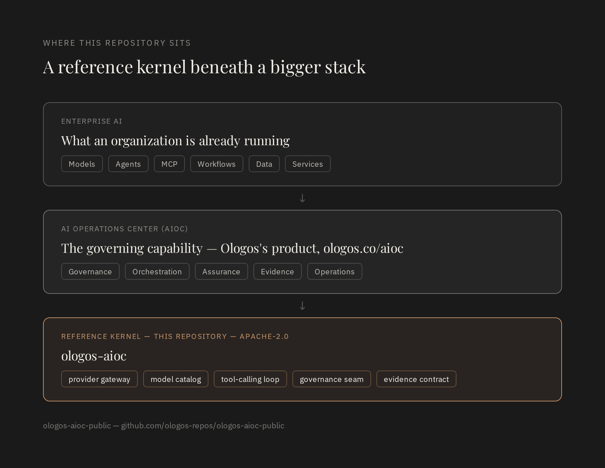

# ologos-aioc

[](https://github.com/ologos-repos/ologos-aioc-public/actions/workflows/ci.yml)
[](LICENSE)
[](pyproject.toml)
[](https://ologos.co)

**[Ologos Corp](https://ologos.co)** is a think tank and innovation
factory — we incubate high-conviction ideas under rigorous systems
discipline, then spin each one off as an independent venture. This
repository is the open core beneath one of those ventures, the
**[AI Operations Center](https://ologos.co/aioc/)**.

**A reference architecture and executable kernel for the control plane
beneath an AI Operations Center (AIOC).**

An AI Operations Center is the enterprise operating capability responsible
for governing, orchestrating, observing, assuring, and evidencing
AI-enabled work across models, agents, tools, data, services, and human
operators. That's a broader claim than "an agent library," and this repo
is built to demonstrate the whole shape of it — as an architecture readers
can inspect, not just a package to install.

In 2026, frontier models proved they can find and exploit software
vulnerabilities faster and more thoroughly than almost any human team —
Anthropic's Project Glasswing alone has already surfaced tens of thousands
of high-severity findings industry-wide. That capability shift cuts both
ways: the same class of model that finds the vulnerability can run the
operation that responds to it, deploys the fix, and holds an audit trail
of what happened. The question every enterprise now faces isn't whether AI
runs in its operations — it's whether that operation is governed, auditable,
and owned, or improvised.

Industry analysis has independently reached the same conclusion. McKinsey's
2025 research on agentic AI: *"ROI comes from strong intent: define the
outcomes, embed agents deep in core workflows, and redesign operating
models around them."* ServiceNow's CEO put it more bluntly: *"Whoever
controls AI governance and orchestration across the enterprise captures a
lot of the value in an agentic future."* The orchestration layer — not the
model — is where enterprises are choosing to consolidate trust.



```bash
pip install git+https://github.com/ologos-repos/ologos-aioc-public.git
```

(Not yet published to PyPI as `ologos-aioc` — installing from GitHub works today; a PyPI release is a reasonable follow-up once the API has settled.)

```python
from ologos_aioc import EchoProvider, ModelCatalog, Orchestrator, Tool, ToolRegistry

catalog = ModelCatalog()
catalog.register("demo", EchoProvider(), tags={"fast"})

tools = ToolRegistry()
tools.register(Tool(
    name="weather", description="Get the weather for a city",
    parameters={"type": "object", "properties": {"city": {"type": "string"}}},
    handler=lambda city="Fayetteville": f"It's 72F and sunny in {city}.",
))

result = Orchestrator(model=catalog.route("fast"), tools=tools).run("call weather please")
print(result.text)
```

That's the minimal path. The governed path — a tool call actually being
denied, an evidence trail actually being written, capability-aware routing —
is in [`examples/`](examples/):

| Example | Demonstrates |
|---|---|
| [`basic_usage.py`](examples/basic_usage.py) | The minimal loop above, runnable with no API key |
| [`governed_tool_call.py`](examples/governed_tool_call.py) | A DENY decision preventing a tool's handler from ever running |
| [`evidence_capture.py`](examples/evidence_capture.py) | A full run's lifecycle written to a JSON-lines evidence log |
| [`domain_routing.py`](examples/domain_routing.py) | Routing by capability tag, domain, and risk — not just a name |
| [`domain_profile.py`](examples/domain_profile.py) | Two domains, two declarative capability surfaces, one control plane |

## Why this exists

Enterprises building on LLMs keep re-solving the same handful of problems
before they get to anything domain-specific: talk to more than one model
provider without hardcoding a vendor SDK everywhere, give the model tools
and actually execute what it asks for, have somewhere to hang policy —
identity, audit, cost limits — without threading it through every call
site by hand, and prove afterward that governed work actually happened.
This library is that layer.

It deliberately does **not** include a governed multi-tenant identity/audit
system, a domain-console UI, or an air-gapped/sovereign deployment pattern.
Those are real, harder problems that Ologos operates as a managed product —
see [ologos.co/aioc](https://ologos.co/aioc/) — built on top of this same
open interface. `GovernanceHook` is the seam: the open core ships a no-op
default and a working decision gate, a governed deployment supplies the
real policy.


## Background

Ologos has developed and operated orchestration and governance patterns
like these internally since late 2025, as part of our AI Operations Center
(AIOC) work for enterprise and public-sector engagements. This package is a
new, independently written reference implementation of that architecture —
not an extraction of any client or internal codebase — released so the
pattern itself is available to build on, separate from the governed
product built around it. See [`IP-BOUNDARY.md`](IP-BOUNDARY.md) for exactly
where that line is drawn.

The formal specification behind the governance seam is the **AI Harness
Engineering Standard (AHES)**, a public, normative standard for the control
environment surrounding AI models and agents: see
[ologos-repos/ai-harness-engineering](https://github.com/ologos-repos/ai-harness-engineering)
(draft v0.1).

## Architecture

The full six-layer operating model — identity, authority, routing,
execution, evidence, domain experience — and which layers this repo fully
implements versus contracts for, is in [`ARCHITECTURE.md`](ARCHITECTURE.md).
The short version:


- **`ExecutionContext`** — the identity of a single run: a run ID plus
  generic actor/purpose/domain metadata. No opinion about what those mean
  in your deployment.
- **`ModelProvider`** — one method, `complete(messages, tools) -> ModelResponse`.
  Ships `EchoProvider` (network-free, for tests/demos) and
  `OpenAICompatibleProvider` (any OpenAI-chat-completions-shaped endpoint).
- **`ModelCatalog`** / **`CapabilityDescriptor`** — register named models
  with capability tags and risk/domain metadata; route by what's needed,
  not a hardcoded model string.
- **`ToolRegistry`** / **`Tool`** — register Python callables with a JSON
  Schema and optional capability metadata (side-effecting or not).
- **`GovernanceHook`** / **`GovernanceDecision`** — the decision gate. A
  DENY or REQUIRE_CONFIRMATION disposition prevents a tool's handler from
  running at all, not just logs it afterward — proven in
  [`CONFORMANCE.md`](CONFORMANCE.md), not just described here.
- **`EvidenceRecorder`** / **`OperationStage`** — an optional, explicit
  evidence plane: every stage of a run's lifecycle can produce a record.
  The shipped recorders are illustrative only, not audit-grade.
- **`profiles.py`** — declarative domain-console contracts: the same
  control plane, a different capability surface per operating domain.
- **`Orchestrator`** — ties all of the above into the actual
  dispatch-and-tool-call loop, with `MaxIterationsExceeded` as the
  runaway-loop backstop.

## Conformance

This isn't just described behavior — `CONFORMANCE.md` lists eight
requirements (unique run IDs, the governance gate actually blocking
execution, evidence capture being explicit not implicit, and more), each
backed by a real test:

```bash
pytest tests/test_conformance.py -v
```

## Related work

This library synthesizes patterns from the broader open-source AI agent
ecosystem rather than inventing them in isolation — most directly
[LangChain](https://github.com/langchain-ai/langchain) (model-agnostic
orchestration), [NVIDIA NeMo / NemoClaw](https://www.nvidia.com/en-us/ai/nemoclaw/)
(enterprise agent stacks with a runtime-policy seam, alpha as of mid-2026),
[OpenClaw](https://github.com/openclaw/openclaw) (the self-hosted,
multi-channel gateway pattern for AI agents), and
[OpenCode](https://github.com/anomalyco/opencode) (the open-source coding-agent
pattern, MIT). What's distinctive is the integration of these concepts into
a coherent operating model, and the research program behind it — published
openly, independent of any client engagement:

- [AEON: An Enterprise Control Plane Architecture for the Agentic Era](https://doi.org/10.5281/zenodo.20349596)
- [OAgents: A Pre-Standardization Draft Profile for Operational AI Agent Trustworthiness](https://doi.org/10.5281/zenodo.19427785)
- [AIDEX: An Architecture for Human-Curated, AI-Enabled Knowledge Work](https://doi.org/10.5281/zenodo.20349597)
- [Mx-Modes: A Meta-Harness Framework for Multi-Mode AI Operation](https://doi.org/10.5281/zenodo.20419449)
- [Ordinal Systems Architecture (OrdSA): A Control Grammar for Enterprise AI Authority](https://doi.org/10.5281/zenodo.20334233)
- [Portable Agent Harness Architecture (PAHA)](https://doi.org/10.5281/zenodo.20112632)

The full, formalized specification is the [AI Harness Engineering Standard (AHES)](https://github.com/ologos-repos/ai-harness-engineering).

## Development

```bash
pip install -e ".[dev]"
pytest
```

## License

Apache License 2.0 — see [`LICENSE`](LICENSE).
