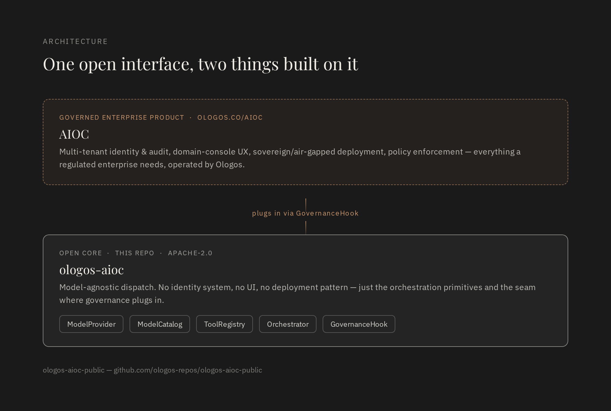

# ologos-aioc

**The open core beneath Ologos's AI Operations Center (AIOC).**

In 2026, frontier models proved they can find and exploit software
vulnerabilities faster and more thoroughly than almost any human team —
Anthropic's Project Glasswing alone has already surfaced tens of thousands
of high-severity findings industry-wide. That capability shift cuts both
ways: the same class of model that finds the vulnerability can run the
operation that responds to it, deploys the fix, and holds an audit trail
of what happened. The question every enterprise now faces isn't whether AI
runs in its operations — it's whether that operation is governed, auditable,
and owned, or improvised.

Industry analysis has independently reached the same conclusion. McKinsey's
2025 research on agentic AI: *"ROI comes from strong intent: define the
outcomes, embed agents deep in core workflows, and redesign operating
models around them."* ServiceNow's CEO put it more bluntly: *"Whoever
controls AI governance and orchestration across the enterprise captures a
lot of the value in an agentic future."* The orchestration layer — not the
model — is where enterprises are choosing to consolidate trust.

`ologos-aioc` is the openly published core of that layer: a small,
model-agnostic orchestration library — provider gateway, model catalog,
tool-calling loop, and a governance extension point — released so the
pattern is available to build on, independent of the governed enterprise
product built on top of it. See [ologos.co/aioc](https://ologos.co/aioc/)
for that product and the case for why it matters at enterprise scale, and
the [AI Harness Engineering Standard](https://github.com/ologos-repos/ai-harness-engineering)
for the formal specification behind the governance seam below.

```bash
pip install git+https://github.com/ologos-repos/ologos-aioc-public.git
```

(Not yet published to PyPI as `ologos-aioc` — installing from GitHub works today; a PyPI release is a reasonable follow-up once the API has settled.)

```python
from ologos_aioc import EchoProvider, ModelCatalog, Orchestrator, Tool, ToolRegistry

catalog = ModelCatalog()
catalog.register("demo", EchoProvider(), tags={"fast"})

tools = ToolRegistry()
tools.register(Tool(
    name="weather", description="Get the weather for a city",
    parameters={"type": "object", "properties": {"city": {"type": "string"}}},
    handler=lambda city="Fayetteville": f"It's 72F and sunny in {city}.",
))

result = Orchestrator(model=catalog.route("fast"), tools=tools).run("call weather please")
print(result.text)
```

See [`examples/basic_usage.py`](examples/basic_usage.py) for a runnable, dependency-free
version of the above (no API key required).

## Why this exists

Enterprises building on LLMs keep re-solving the same handful of problems
before they get to anything domain-specific: talk to more than one model
provider without hardcoding a vendor SDK everywhere, give the model tools
and actually execute what it asks for, and have *somewhere* to hang policy
— identity checks, audit capture, cost limits — without threading it through
every call site by hand. This library is that layer, and only that layer.

It deliberately does **not** include a governed multi-tenant identity/audit
system, a domain-console UI, or an air-gapped/sovereign deployment pattern.
Those are real, harder problems that Ologos operates as a managed product —
see [ologos.co/aioc](https://ologos.co/aioc/) — built on top of this same
open interface. `GovernanceHook` is the seam: the open core ships a no-op
default, a governed deployment supplies a real one.



## Background

Ologos has developed and operated orchestration and governance patterns
like these internally since late 2025, as part of our AI Operations Center
(AIOC) work for enterprise and public-sector engagements. This package is a
new, independently written, open-source implementation of that core
pattern — not an extraction of any client or internal codebase — released
so the pattern itself is available to build on, separate from the governed
product built around it.

The formal specification behind the governance seam is the **AI Harness
Engineering Standard (AHES)**, a public, normative standard for the control
environment surrounding AI models and agents: see
[ologos-repos/ai-harness-engineering](https://github.com/ologos-repos/ai-harness-engineering)
(draft v0.1).

## Architecture


- **`ModelProvider`** — one method, `complete(messages, tools) -> ModelResponse`.
  Ships `EchoProvider` (network-free, for tests/demos) and
  `OpenAICompatibleProvider` (any OpenAI-chat-completions-shaped endpoint —
  covers OpenAI itself and most self-hosted/open-weight serving stacks).
  Add your own by subclassing.
- **`ModelCatalog`** — register named models with capability tags
  (`"fast"`, `"reasoning"`, ...); route by tag instead of hardcoding a
  model string at every call site.
- **`ToolRegistry`** / **`Tool`** — register Python callables with a JSON
  Schema; the orchestrator handles turning model tool-calls into real
  execution and feeding results back.
- **`Orchestrator`** — the loop itself: dispatch, execute any tool calls,
  repeat until a final answer or `max_tool_iterations` is hit
  (`MaxIterationsExceeded` is the runaway-loop backstop).
- **`GovernanceHook`** — the extension point described above.

## Related work

This library synthesizes patterns from the broader open-source AI agent
ecosystem rather than inventing them in isolation — most directly
[LangChain](https://github.com/langchain-ai/langchain) (model-agnostic
orchestration), [NVIDIA NeMo / NemoClaw](https://www.nvidia.com/en-us/ai/nemoclaw/)
(enterprise agent stacks with a runtime-policy seam, alpha as of mid-2026),
[OpenClaw](https://github.com/openclaw/openclaw) (the self-hosted,
multi-channel gateway pattern for AI agents), and
[OpenCode](https://github.com/anomalyco/opencode) (the open-source coding-agent
pattern, MIT). What's original here is the governance seam itself
(`GovernanceHook`) and the research behind it — published openly, independent
of any client engagement:

- [AEON: An Enterprise Control Plane Architecture for the Agentic Era](https://doi.org/10.5281/zenodo.20349596)
- [OAgents: A Pre-Standardization Draft Profile for Operational AI Agent Trustworthiness](https://doi.org/10.5281/zenodo.19427785)
- [AIDEX: An Architecture for Human-Curated, AI-Enabled Knowledge Work](https://doi.org/10.5281/zenodo.20349597)
- [Mx-Modes: A Meta-Harness Framework for Multi-Mode AI Operation](https://doi.org/10.5281/zenodo.20419449)
- [Ordinal Systems Architecture (OrdSA): A Control Grammar for Enterprise AI Authority](https://doi.org/10.5281/zenodo.20334233)
- [Portable Agent Harness Architecture (PAHA)](https://doi.org/10.5281/zenodo.20112632)

The full, formalized specification is the [AI Harness Engineering Standard (AHES)](https://github.com/ologos-repos/ai-harness-engineering).

## Development

```bash
pip install -e ".[dev]"
pytest
```

## License

Apache License 2.0 — see [`LICENSE`](LICENSE).
